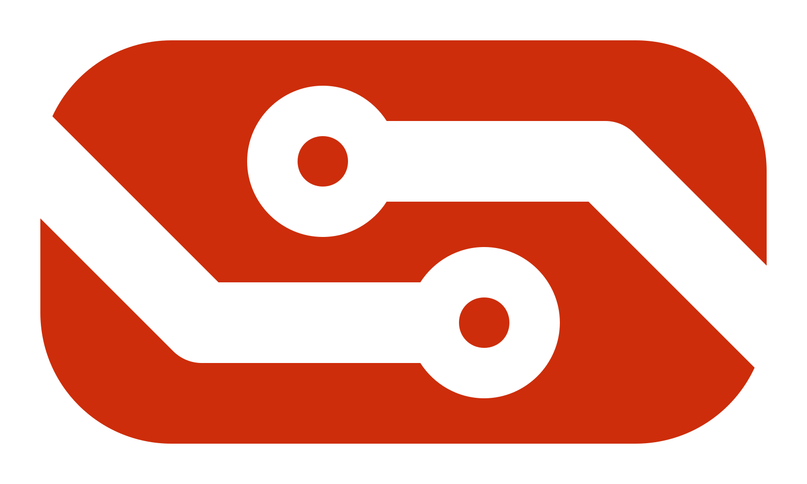
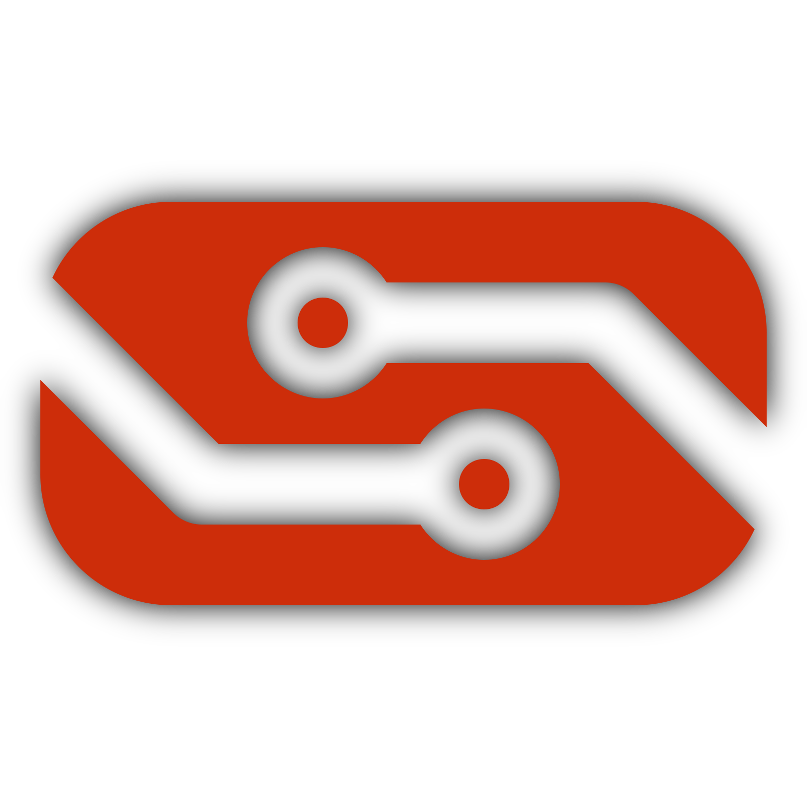
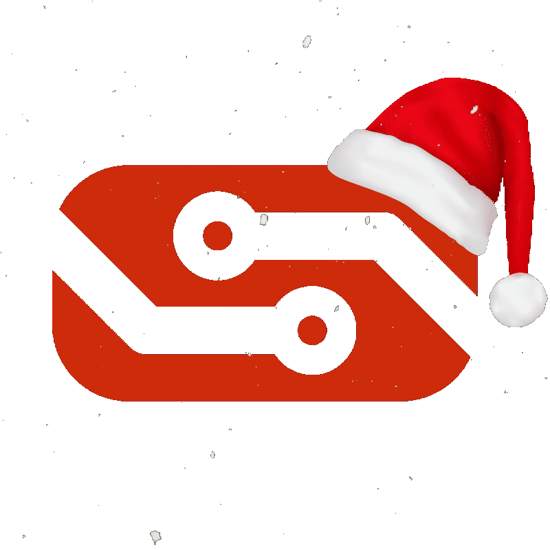
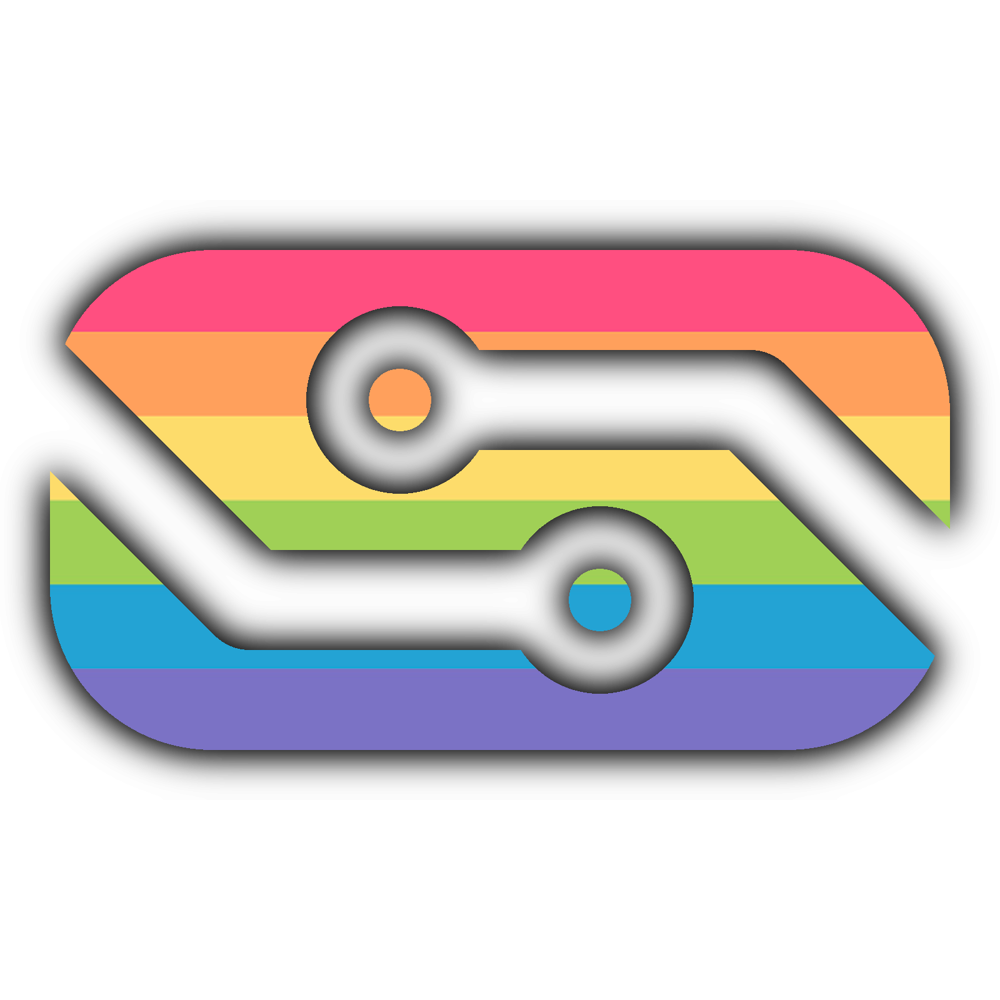
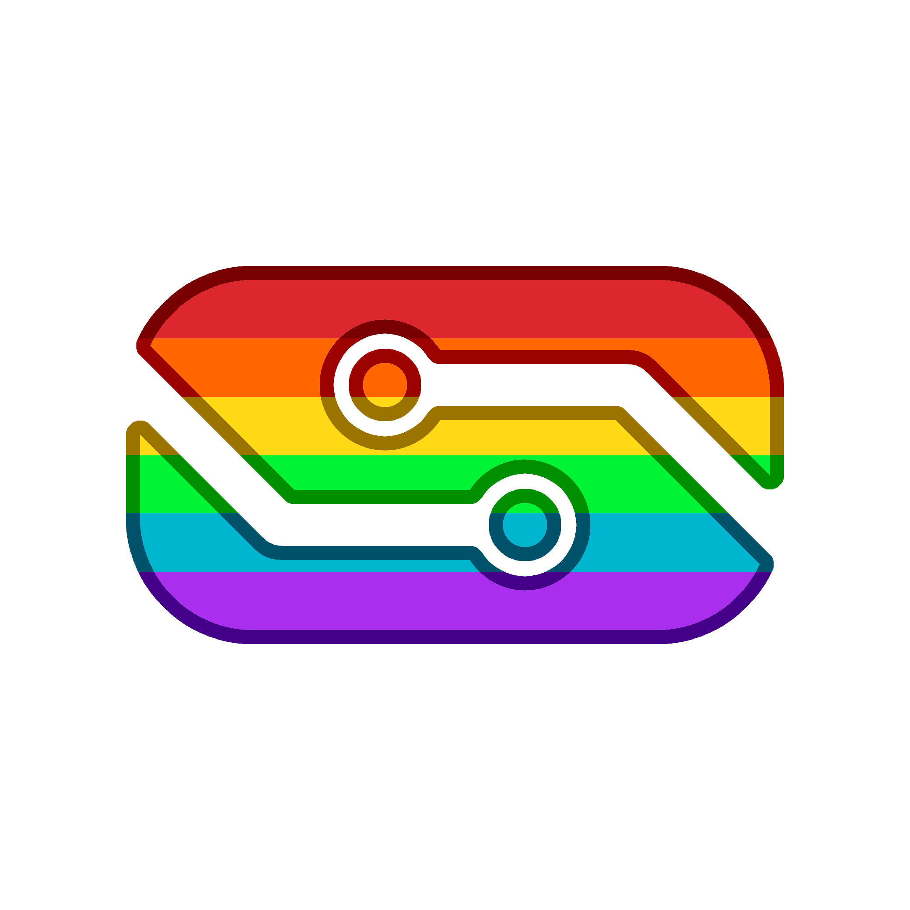
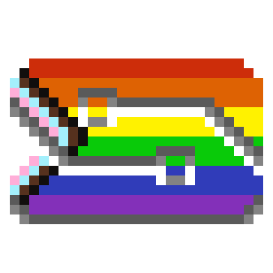
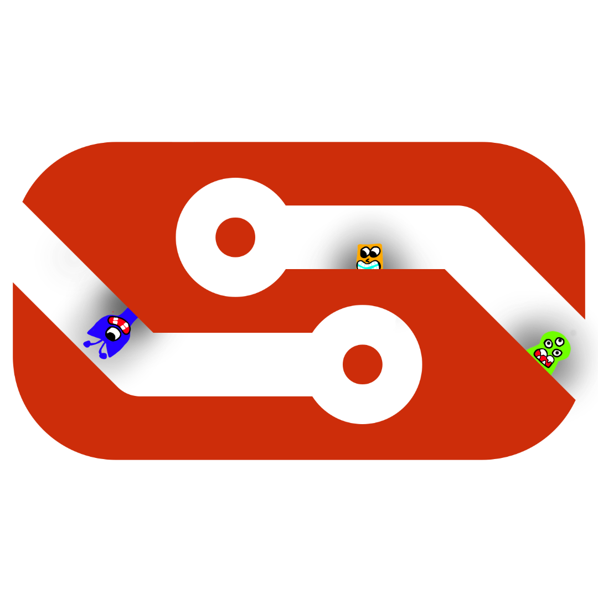
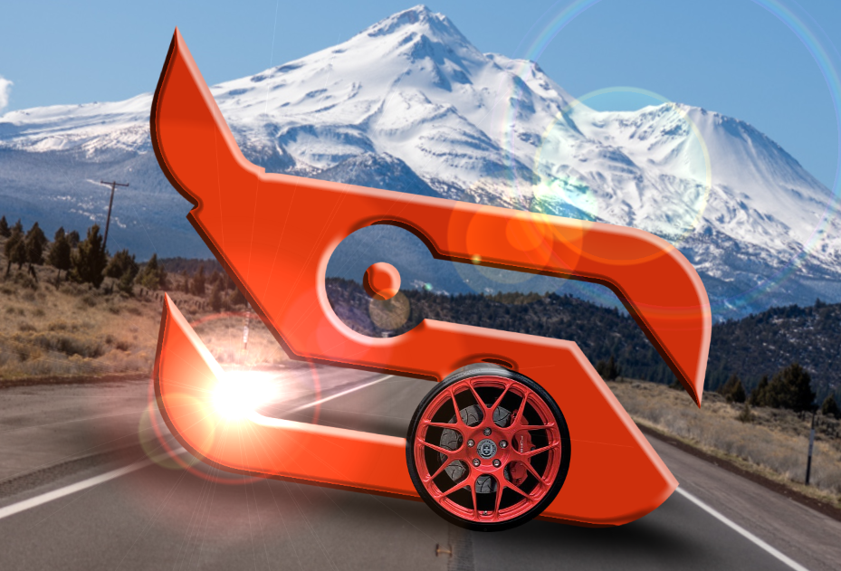
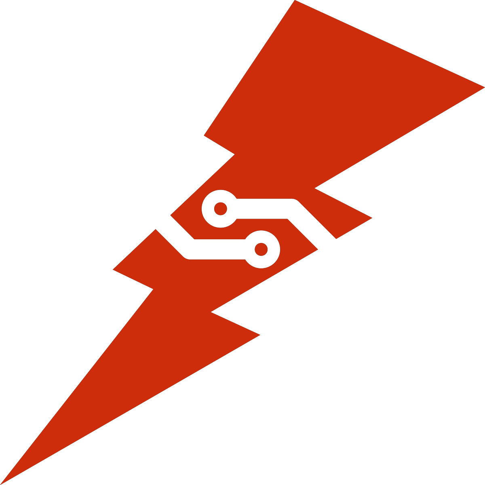

# Open Redstone Engineers Brand

Welcome to the official **Open Redstone Engineers (ORE)** brand repository!
Here you'll find the definitions of our brand assets, including logos, colors, and name.

## Table of Contents
1. [Name](#name)
2. [Logo](#logo)
3. [Colors](#colors)

## Name

The ORE name can be used differently depending on the context.

| Full Name               | Open Redstone Engineers                |
|-------------------------|----------------------------------------|
| Acronym                 | ORE                                    |
| Short Name              | Open Redstone                          |

## Logo

The original logo was designed by PabloDons, who provides some insight on the design process:
> I don’t remember what triggered it, but we decided one day that we need a new theme for our (at the time) mybb forum.
Back when I was but a wee lad still in highschool, and somehow rocking a bottomless confidence for anything technology I basically just cheated, stole some theme off the internet and messed with the colors till they looked sorta OREy.
I was really into it and went for a logo as well to top it all off.
True genius really just comes out of the blue and without your consent I guess, but I had this vision of wires all wiggly and random, so I drew some lines on a grid that resembled the letters and just kept adding wires.
I searched “vector drawing software” and pulled up inkscape and brought it into reality.
This was supposed to be the header on the mybb forum, but also a website favicon needed to match, so I was on that as well.
I had the focus of Nickster discovering trains for the first time and probably drew almost a hundred designs before Decapo pointed one out and screamed his heart out about it in a slack chat.
Back to inkscape.
Exported and dropped into a favicon generator.
I still have the damn notebook I violated with a red marker.
A true beauty.

Some of the original concept drawings:

### Primary Logo
The primary logo should be used in most situations. An SVG of this same image is provided [here](logo/oreicon.svg)

There is also a square version with a shadow used for Discord and other platforms that benefit from the square aspect ratio:

### Alternate Logos
It should come as no surprise to our community that we love alternatives derived from the original logo.
Some of these alternatives are as follows:
- Christmas/Holidays

- Pride

- Other

## Colors

ORE has a single primary color that represents our identity.

### Primary Color

| Color      | Hex       | RGB           | Usage                 |
|------------|-----------|---------------|-----------------------|
| ORE Red    | `#CD2D0A` | `205, 45, 10` | Main branding color   |

## Unofficial Usage

We love seeing people use and reference Open Redstone Engineers!
If your project, content, or communication is not an official Open Redstone Engineers project, please make that clear so there’s no confusion about what is officially run by ORE.

To avoid confusion, we ask that you:

- Include a short disclaimer where appropriate (websites, videos, descriptions, etc.).
- Avoid using our name or logo in ways that suggest sponsorship or partnership.
- Clearly distinguish unofficial projects or communications from official ORE content.
